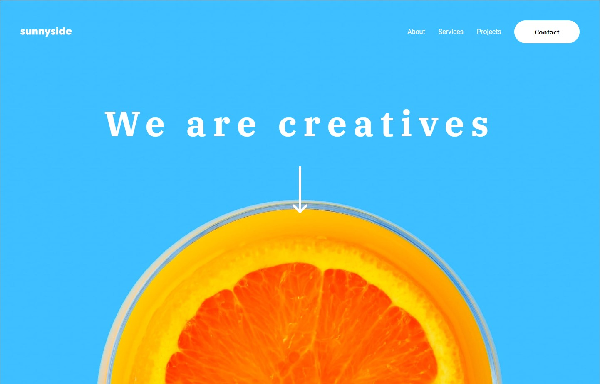

# Frontend Mentor - Sunnyside agency landing page solution

This is a solution to the [Sunnyside agency landing page challenge on Frontend Mentor](https://www.frontendmentor.io/challenges/sunnyside-agency-landing-page-7yVs3B6ef). Frontend Mentor challenges help you improve your coding skills by building realistic projects.

### Screenshot

# Frontend Mentor - Sunnyside agency landing page solution

### Links

- Solution URL: [here](https://github.com/zdenman/Sunnyside-agency-landing-page)
- Live Site URL: [here](http://qr-code-component-zdenman.vercel.app/)

### Built with

- Semantic HTML5 markup
- CSS custom properties
- SASS
- Flexbox

### What I learned

This is very mini project but this is my first time learning and working with SASS.

## Author

- Website - [Zdeno Ceman](https://www.zdenoceman.com)
- Frontend Mentor - [@zdenman](https://www.frontendmentor.io/profile/zdenman)
